# promise-array-parallel

[](https://jsr.io/@gunseikpaseri/promise-array-parallel) [](https://opensource.org/licenses/MIT) [](https://twitter.com/GunseiKPaseri)   [](https://www.codefactor.io/repository/github/gunseikpaseri/promise-array-parallel)

## Language Support
- [English](/README.md)
- 日本語

## 概要

PromiseArrayParallelは、`Promise.all()`や`.map()`の操作感で非同期タスクを簡単に並列実行するためのユーティリティライブラリです。このライブラリは複数の非同期処理を効率的に管理し、並列度や実行順序を制御することができます。

主な機能
- 非同期タスクの並列実行
- 処理ごとの並列実行数の制限
- 実行順序の制御（「先着順」または「インデックス順」）
- タスク間のインターバル設定
- エラーハンドリング

## インストール

### npm

```bash
npx jsr add @gunseikpaseri/promise-array-parallel
```

### Deno

```bash
deno add jsr:@gunseikpaseri/promise-array-parallel
```

## 使い方

### 基本的な使い方

```typescript
import { PromiseArray } from "./promise-array-parallel.ts";

// 配列からPromiseArrayインスタンスを作成
const result = await PromiseArray
  .from([1, 2, 3, 4, 5])
  // 配列に対する何らかの非同期処理
  .asyncMap(async ({ value, idx }) => {
    return value * 2;
  }, { maxExecutionSlots: 3 }) // 最大3つのタスクを並列実行
  .all(); // すべての結果を取得

console.log(result); // [2, 4, 6, 8, 10]
```

### 複数の処理パイプライン

```typescript
const result = await PromiseArray
  .from([1, 2, 3, 4, 5])
  .asyncMap(async ({ value }) => {
    // 1つ目の処理
    return value * 2;
  }, { maxExecutionSlots: 3 })
  .asyncMap(async ({ value }) => {
    // 2つ目の処理（1つ目の結果を受け取る）
    return value + 10;
  }, { maxExecutionSlots: 2 }) // 異なる並列度で実行
  .all();

console.log(result); // [12, 14, 16, 18, 20]
```

### 実行順の制御

#### 先着順(`COME`)
`priority: "COME"` オプションを使用すると、タスクが完了した順に次のタスクが実行されます。

```typescript
const result = await PromiseArray
  .from(data)
  .asyncMap(async () => {
    // 処理
  }, { maxExecutionSlots: 20 })
  .asyncMap(async ({ value }) => {
    // 前の処理が完了した順に実行
  }, { maxExecutionSlots: 10, priority: "COME" })
  .all();
```

7つの要素に対して並列度3で2つのタスクを実行する場合、以下のように実行されます。




```mermaid
gantt
    title タスク実行順序: COME
    dateFormat  HH:mm:ss
    axisFormat %M:%S
    
    section オブジェクト1
    タスクA(1): crit, a1, 00:00:00, 2s
    タスクB(1): active, b1, after a1, 3s
    
    section オブジェクト2
    タスクA(2): crit, a2, 00:00:00, 4s
    タスクB(2): active, b2, after a2, 1s
    
    section オブジェクト3
    タスクA(3): crit, a3, 00:00:00, 3s
    タスクB(3): active, b3, after a3, 1s
    
    section オブジェクト4
    タスクA(4): crit, a4, after a1, 1s
    タスクB(4): active, b4, after a4, 6s
    
    section オブジェクト5
    タスクA(5): crit, a5, after a3, 3s
    タスクB(5): active, b5, after a5, 2s
    
    section オブジェクト6
    タスクA(6): crit, a6, after a4, 4s
    タスクB(6): active, b6, after a6, 1s
    
    section オブジェクト7
    タスクA(7): crit, a7, after a5, 2s
    タスクB(7): active, b7, after a7, 2s
```

#### インデックス順(`INDEX`)
`priority: "INDEX"` オプションを使用すると、タスク配列のインデックス順を維持するよう待機して実行されるようになります。
`COME`よりも時間がかかる可能性がありますが、副作用を持つ非同期関数を順番に実行する必要がある場合に使用します。

```typescript
const result = await PromiseArray
  .from(data)
  .asyncMap(async () => {
    // 処理
  }, { maxExecutionSlots: 20 })
  .asyncMap(async ({ value }) => {
    // インデックス順に実行
  }, { maxExecutionSlots: 10, priority: "INDEX" })
  .all();
```

7つの要素に対して並列度3で2つのタスクを実行する場合、以下のように実行されます。



```mermaid
gantt
    title タスク実行順序: INDEX
    dateFormat  HH:mm:ss
    axisFormat %M:%S
    
  
    section オブジェクト1
    タスクA(1): crit, a1_i, 00:00:00, 2s
    タスクB(1): active, b1_i, after a1_i, 3s
    
    section オブジェクト2
    タスクA(2): crit, a2_i, 00:00:00, 4s
    タスクB(2): active, b2_i, after a2_i, 1s
    
    section オブジェクト3
    タスクA(3): crit, a3_i, 00:00:00, 3s
    タスクB(3): active, b3_i, after a2_i, 1s
    
    section オブジェクト4
    タスクA(4): crit, a4_i, after a1_i, 1s
    タスクB(4): active, b4_i, after b3_i, 6s
    
    section オブジェクト5
    タスクA(5): crit, a5_i, after a3_i, 3s
    タスクB(5): active, b5_i, after a5_i, 2s
    
    section オブジェクト6
    タスクA(6): crit, a6_i, after a4_i, 4s
    タスクB(6): active, b6_i, after a6_i, 1s
    
    section オブジェクト7
    タスクA(7): crit, a7_i, after a5_i, 2s
    タスクB(7): active, b7_i, after b6_i, 2s
```

### エラーハンドリング

`PromiseArray.all()`を`await`した場合どれか一つでも失敗すると全て中断してしまいます。`Promise.all([...])`に対する`Promise.allSettled([...])`のように、`PromiseArray.allSettled()`エラーハンドリングを行うことができます。

```typescript
const results = await PromiseArray
  .from(data)
  .asyncMap(async ({ idx }) => {
    if (condition) throw new Error("エラー発生");
    // 処理
  })
  .allSettled();

// 成功したタスクと失敗したタスクの両方の結果が含まれる
results.forEach((result, index) => {
  if (result.status === "fulfilled") {
    console.log(`タスク ${index} 成功:`, result.value);
  } else {
    console.log(`タスク ${index} 失敗:`, result.reason);
  }
});
```

### インターバルの設定

`executionIntervalMS`オプションで、並列タスクにインターバルを設けることができ、タスクの開始時間をずらすことができます。

```typescript
const result = await PromiseArray
  .from(data)
  .asyncMap(async () => {
    // 処理
  }, { maxExecutionSlots: 20, executionIntervalMS: 20 }) // タスク開始間に20msのインターバル
  .all();
```
