# promise-array-parallel

[](https://jsr.io/@gunseikpaseri/promise-array-parallel) [](https://opensource.org/licenses/MIT) [](https://twitter.com/GunseiKPaseri)   [](https://www.codefactor.io/repository/github/gunseikpaseri/promise-array-parallel)

## Language Support
- English
- [日本語](/README-ja.md)

## Overview

**PromiseArrayParallel** is a utility library that simplifies the parallel execution of asynchronous tasks with the same ease as `Promise.all()` or `.map()`. This library allows you to efficiently manage multiple asynchronous processes while controlling concurrency levels and execution order.

### Main Features:
- Parallel execution of asynchronous tasks
- Limit on the number of concurrently running tasks
- Execution order control ("completion order" or "index order")
- Interval setting between tasks
- Error handling

## Installation

```bash
# npm
npx jsr add @gunseikpaseri/promise-array-parallel
# deno
deno add jsr:@gunseikpaseri/promise-array-parallel
```

## Usage

### Basic Usage

```typescript
import { PromiseArray } from "@gunseikpaseri/promise-array-parallel";

// Create a PromiseArray instance from an array
const result = await PromiseArray
  .from([1, 2, 3, 4, 5])
  // Perform some asynchronous operation on each item
  .asyncMap(async ({ value, idx }) => {
    return value * 2;
  }, { maxExecutionSlots: 3 }) // Run a maximum of 3 tasks in parallel
  .all(); // Get all results

console.log(result); // [2, 4, 6, 8, 10]
```

### Multiple Processing Pipelines

```typescript
const result = await PromiseArray
  .from([1, 2, 3, 4, 5])
  .asyncMap(async ({ value }) => {
    // First operation
    return value * 2;
  }, { maxExecutionSlots: 3 })
  .asyncMap(async ({ value }) => {
    // Second operation (receives the result of the first operation)
    return value + 10;
  }, { maxExecutionSlots: 2 }) // Run with a different concurrency level
  .all();

console.log(result); // [12, 14, 16, 18, 20]
```

### Controlling Execution Order

#### Completion Order (`COME`)
Using the `priority: "COME"` option ensures that tasks are executed in the order they finish.

```typescript
const result = await PromiseArray
  .from(data)
  .asyncMap(async () => {
    // Processing
  }, { maxExecutionSlots: 20 })
  .asyncMap(async ({ value }) => {
    // Execute in completion order
  }, { maxExecutionSlots: 10, priority: "COME" })
  .all();
```

When executing two tasks on seven elements with a concurrency of 3, the execution order is as follows:

```mermaid
gantt
    title Task Execution Order: COME
    dateFormat  HH:mm:ss
    axisFormat %M:%S
    
    section Object 1
    Task A(1): crit, a1, 00:00:00, 2s
    Task B(1): active, b1, after a1, 3s
    
    section Object 2
    Task A(2): crit, a2, 00:00:00, 4s
    Task B(2): active, b2, after a2, 1s
    
    section Object 3
    Task A(3): crit, a3, 00:00:00, 3s
    Task B(3): active, b3, after a3, 1s
    
    section Object 4
    Task A(4): crit, a4, after a1, 1s
    Task B(4): active, b4, after a4, 6s
    
    section Object 5
    Task A(5): crit, a5, after a3, 3s
    Task B(5): active, b5, after a5, 2s
    
    section Object 6
    Task A(6): crit, a6, after a4, 4s
    Task B(6): active, b6, after a6, 1s
    
    section Object 7
    Task A(7): crit, a7, after a5, 2s
    Task B(7): active, b7, after a7, 2s
```



#### Index Order (`INDEX`)
Using the `priority: "INDEX"` option ensures tasks are executed in the original array order, even if it takes longer than `COME`. This is useful when you need to process asynchronous functions in sequence.

```typescript
const result = await PromiseArray
  .from(data)
  .asyncMap(async () => {
    // Processing
  }, { maxExecutionSlots: 20 })
  .asyncMap(async ({ value }) => {
    // Execute in index order
  }, { maxExecutionSlots: 10, priority: "INDEX" })
  .all();
```

For seven elements with two tasks running in parallel (concurrency of 3), the execution order is as follows:

```mermaid
gantt
    title Task Execution Order: INDEX
    dateFormat  HH:mm:ss
    axisFormat %M:%S
    
    section Object 1
    Task A(1): crit, a1_i, 00:00:00, 2s
    Task B(1): active, b1_i, after a1_i, 3s
    
    section Object 2
    Task A(2): crit, a2_i, 00:00:00, 4s
    Task B(2): active, b2_i, after a2_i, 1s
    
    section Object 3
    Task A(3): crit, a3_i, 00:00:00, 3s
    Task B(3): active, b3_i, after a2_i, 1s
    
    section Object 4
    Task A(4): crit, a4_i, after a1_i, 1s
    Task B(4): active, b4_i, after b3_i, 6s
    
    section Object 5
    Task A(5): crit, a5_i, after a3_i, 3s
    Task B(5): active, b5_i, after a5_i, 2s
    
    section Object 6
    Task A(6): crit, a6_i, after a4_i, 4s
    Task B(6): active, b6_i, after a6_i, 1s
    
    section Object 7
    Task A(7): crit, a7_i, after a5_i, 2s
    Task B(7): active, b7_i, after b6_i, 2s
```



### Error Handling

When calling `PromiseArray.all()`, if any task fails, the entire process will stop. Similar to `Promise.allSettled([...])` in contrast to `Promise.all([...])`, you can use `PromiseArray.allSettled()` for error handling.

```typescript
const results = await PromiseArray
  .from(data)
  .asyncMap(async ({ idx }) => {
    if (condition) throw new Error("Error occurred");
    // Processing
  })
  .allSettled();

// Includes both successful and failed task results
results.forEach((result, index) => {
  if (result.status === "fulfilled") {
    console.log(`Task ${index} succeeded:`, result.value);
  } else {
    console.log(`Task ${index} failed:`, result.reason);
  }
});
```

### Setting Intervals

Using the `executionIntervalMS` option, you can set an interval between parallel tasks, delaying their start times.

```typescript
const result = await PromiseArray
  .from(data)
  .asyncMap(async () => {
    // Processing
  }, { maxExecutionSlots: 20, executionIntervalMS: 20 }) // 20ms interval between task starts
  .all();
```
